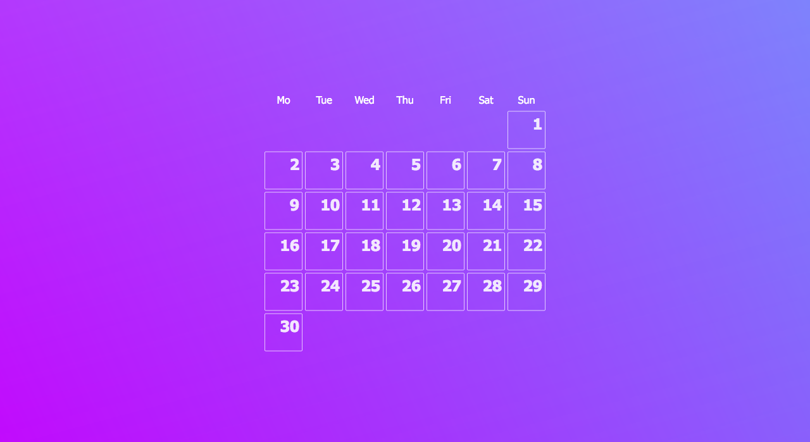
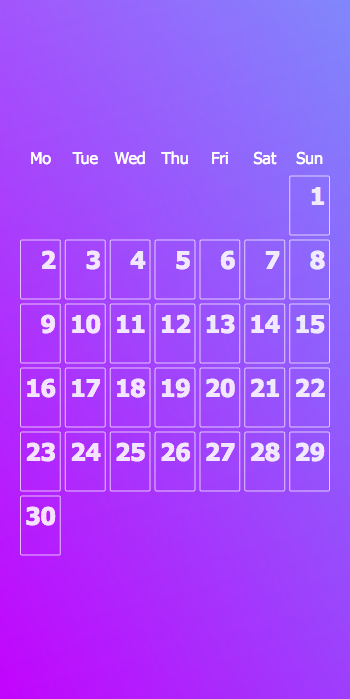
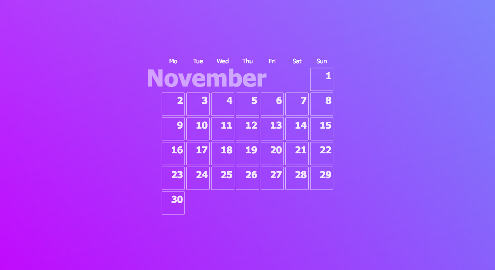
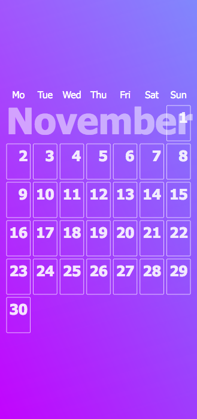
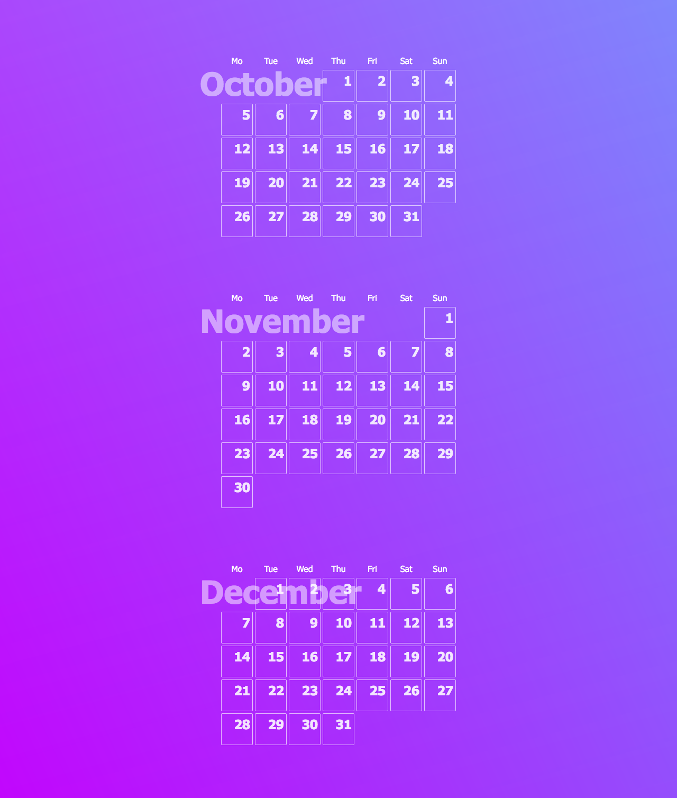
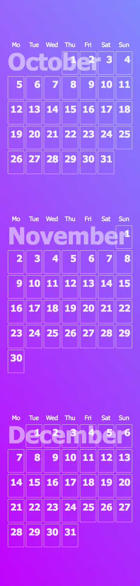

# Calendar

Let's create a calendar with CSS Grid:

This is how it should look like on desktop:

This is how it should look like on mobile:

Add hover effect when you hover on the days, but not on the week days labels.

---------------

Next, you can add text to indicate which month it is:

Desktop:

Mobile:

For this you can make use of pseudo elements, for example.

---------------

Now, let's add the last three months of the year:

Desktop:

Mobile:

---------------

> Use Emmet to create the HTML
